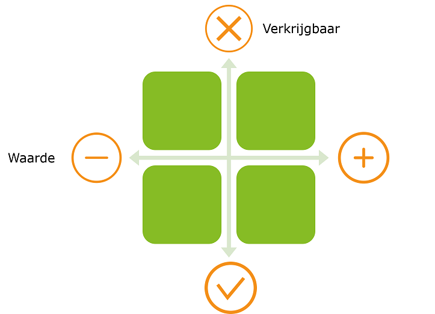

**[Inhoud](ToC.md)**

### :three: Stap 3: Verzamel de data

Een oefening die kan helpen om de juiste data te verzamelen voor het beantwoorden van de vraag is het invullen van onderstaande matrix.

> Tip: kijk bij de analyse van gewenste databronnen niet alleen binnen de eigen organisatie. Er zijn veel waardevolle externe (open) databronnen.

## Voorbeelden van externe databronnen

+ Data.overheid.nl (landelijke data-bibliotheek van algemeen beschikbare data)
+ Verzekeringsmaatschappijen
+ IB-groep
+ Kadaster
+ Waterschappen
+ Woningbouwverenigingen
+ Nationaal geo-register
+ CBS
+ KNMI [[Voorbeeld gebruik meetwaarden KNMI]]( metamorphoses_data_knmi.md)
+ Basisregistratie Grootschalige Topografie. [[Voorbeeld gebruik BGT data]]( metamorphoses_data_bgt.md)

## Nieuwe data creëeren

Een andere mogelijkheid om aan de gewenste data te komen, is door zelf nieuwe data te genereren. Een voorbeeld hiervan is het Snuffelfiets project. [[meer over het Snuffelfiets project]](metamorphoses_voorbeeld_snuffelfiets.md)

Wanneer op bovenstaande opties allemaal niet tot de gewenste data leiden is het noodzakelijk om terug te gaan naar [Stap 2](stap_2.md). Pas je KPI's aan zodat veranderingen wél meetbaar worden. 

**[Inhoud](ToC.md)**
